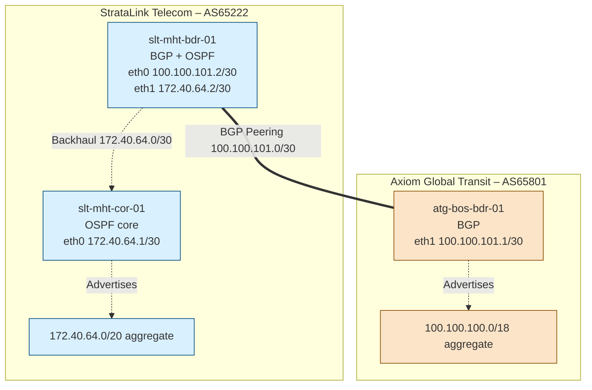

## 🌐 Docker Internet Emulator

Explore inter-domain routing between **StrataLink Telecom (AS65222)** and **Axiom Global Transit (AS65801)** using Docker and FRRouting 8. Every router boots from a reproducible image, so you can practice BGP and OSPF workflows without touching your host network stack.

### ✨ Highlights

- **Composable topology** – `docker-compose.yml` includes per-AS bundles that extend shared router templates.
- **Reusable FRR image** – border and interior routers share an Ubuntu + FRR 8 base image with helper entrypoints.
- **Deterministic interfaces** – ipvlan networks and explicit `interface_name` assignments keep link naming consistent across runs.
- **Policy experimentation** – optional prefix-lists and route-maps let you explore ingress filtering beyond the default `ALLOW-ALL` lab setup.

### 📋 Overview

#### 🛰️ StrataLink Telecom – AS65222

- **Routers**
  - `slt-mht-bdr-01` (border, BGP + OSPF) – `eth0 100.100.101.2/30`, `eth1 172.40.64.2/30`, loopback/router ID `172.40.64.1`
  - `slt-mht-cor-01` (core, OSPF) – `eth0 172.40.64.1/30`
- **Advertised aggregate**: `172.40.64.0/20`
- **Profiles**: `slt-as`, `all-isps`

#### 🛰️ Axiom Global Transit – AS65801

- **Routers**
  - `atg-bos-bdr-01` (border, BGP) – `eth1 100.100.101.1/30`, loopback/router ID `100.100.100.1`
- **Advertised aggregate**: `100.100.100.0/18`
- **Profiles**: `agt-as`, `all-isps`

Both AS definitions live in dedicated Compose files (`AS-65222-SLT.yml`, `AS-65801-AGT.yml`) that extend the shared templates from `router-templates.yml` and map each physical link to a docker ipvlan network.

### 🧩 Compose building blocks

```
docker-compose.yml
├─ router-templates.yml        # Canonical definitions for border/interior routers
├─ AS-65222-SLT.yml            # StrataLink Telecom topology (border + core)
└─ AS-65801-AGT.yml            # Axiom Global Transit topology (border)
```

- `router-templates.yml` declares template services for `border-router` and `interior-router`. Both mount the `scripts/` directory read-only and start via role-specific entrypoints.
- Each AS file supplies hostnames, container names, environment variables, and binds docker networks to `eth0`/`eth1` as needed.
- Compose profiles (`all-isps`, `slt-as`, `agt-as`) let you launch the full lab or focus on a single autonomous system.

### 📡 Autonomous systems in this release

| AS    | ISP                     | Routers (role)                                                                 | Advertised space          | Key links                                                |
|-------|-------------------------|--------------------------------------------------------------------------------|---------------------------|----------------------------------------------------------|
| 65222 | StrataLink Telecom      | `slt-mht-bdr-01` (border, BGP + OSPF)<br>`slt-mht-cor-01` (core, OSPF)         | `172.40.64.0/20`          | Peering `100.100.101.0/30` (`eth0`)<br>Backhaul `172.40.64.0/30` (`eth1`) |
| 65801 | Axiom Global Transit    | `atg-bos-bdr-01` (border, BGP)                                                 | `100.100.100.0/18`        | Peering `100.100.101.0/30` (`eth1`)                      |

### 🗺️ Topology



### 🚀 Getting started

1. **Prerequisites** – Docker Engine with the Compose V2 plugin on Linux.
2. **Build and launch everything**
   ```bash
   docker compose --profile all-isps up --build
   ```
3. **Check status**
   ```bash
   docker compose --profile all-isps ps
   ```
4. **Run a single AS profile**
   ```bash
   docker compose --profile slt-as up
   docker compose --profile agt-as up
   ```
5. **Stop and clean up**
   ```bash
   docker compose --profile all-isps down
   ```

### 🔧 Router bootstrap sequence

Both entrypoint scripts (`entrypoint-border.sh`, `entrypoint-interior.sh`) perform the following steps:

1. Print a banner indicating the ISP and ASN being configured.
2. Copy the appropriate `daemons` template for the router role into `/etc/frr/daemons`.
3. Copy `scripts/frr-${HOSTNAME}.conf` into `/etc/frr/frr.conf`.
4. Enable IPv4 forwarding (`sysctl -w net.ipv4.ip_forward=1`). Border routers also flush docker-assigned IPv4 addresses from each interface.
5. Start the FRR service via `/etc/init.d/frr start` and keep the container running with `sleep infinity`.

### 📑 Key FRR configs

#### `scripts/frr-slt-mht-bdr-01.conf`

- Router ID `172.40.64.1` with a loopback `/32`.
- `eth0` peers with Axiom (`100.100.101.1/30`), `eth1` backhauls to StrataLink core (`172.40.64.2/30`).
- Advertises `172.40.64.0/20` under BGP AS 65222 and currently applies `ALLOW-ALL` inbound/outbound route-maps.

#### `scripts/frr-atg-bos-bdr-01.conf`

- Router ID `100.100.100.1` with loopback `/32`.
- `eth1` peers with StrataLink (`100.100.101.2/30`).
- Advertises `100.100.100.0/18` under BGP AS 65801 and mirrors the `ALLOW-ALL` policy.

> Debug logging (`debug bgp ...`) is enabled on both routers; check `/var/log/frr/frr.log` inside each container for protocol events.

### 🛡️ Filtering inbound routes

Swap the permissive route-map on StrataLink's border router with a prefix-list backed policy when you need selective acceptance:

```text
ip prefix-list ACCEPTED-PREFIXES seq 10 permit 192.0.2.0/24
ip prefix-list ACCEPTED-PREFIXES seq 20 permit 198.51.100.0/24

route-map ACCEPT-FILTER permit 10
 match ip address prefix-list ACCEPTED-PREFIXES

router bgp 65222
 address-family ipv4 unicast
  neighbor 100.100.101.1 route-map ACCEPT-FILTER in
 exit-address-family
```

Any route that fails to match `ACCEPTED-PREFIXES` is rejected by default. Add more `permit` statements or a trailing `deny` to model stricter policies. For quick homelab runs, keeping `ALLOW-ALL` is still perfectly fine.

### 🧪 Validation checklist

- **BGP adjacency**
  ```bash
  docker exec -it slt-mht-bdr-01 vtysh -c "show ip bgp summary"
  docker exec -it atg-bos-bdr-01 vtysh -c "show ip bgp summary"
  ```
- **Route tables**
  ```bash
  docker exec -it slt-mht-bdr-01 vtysh -c "show ip bgp"
  docker exec -it atg-bos-bdr-01 vtysh -c "show ip bgp"
  ```
- **Reachability tests**
  ```bash
  docker exec -it slt-mht-bdr-01 ping -I 172.40.64.1 100.100.101.1
  docker exec -it atg-bos-bdr-01 ping -I 100.100.100.1 172.40.64.1
  docker exec -it slt-mht-cor-01 vtysh -c "show ip ospf neighbor"
  ```

Sample BGP output (StrataLink border):

```
   Network          Next Hop            Metric LocPrf Weight Path
*> 100.100.100.0/18 100.100.101.1            0             0 65801 i
*> 172.40.64.0/20   0.0.0.0                  0         32768 i
```

### 🐞 Troubleshooting tips

- `docker logs <container>` captures entrypoint output (useful for copy or permission issues).
- `docker exec -it <container> vtysh -c "show logging"` surfaces FRR debug logs without leaving the CLI.
- Confirm ipvlan networks with `docker network ls`; each point-to-point link is defined in the AS-specific YAML files.
- If Compose warns about unknown profiles, upgrade to Compose v2.17+.

### 🧭 Next steps

- Add IPv6 advertisements (`2001:db8:beef::/40`, `2001:db8:101::/36`).
- Use `customer-templates.yml` as a starting point for customer edge routers.
- Layer on telemetry or alerting (e.g., [BGPalerter](https://github.com/nttgin/BGPalerter)).
- Introduce service nodes (DNS, web) behind StrataLink to test policy routing.
- Experiment with route filtering, prepending, and MEDs between the two ASNs.