## 🌐 Docker Internet Emulator

Learning and experimentation with routing FRR using Docker. 

### 📋 Overview

This is a multi-AS internet emulator with border and interior routers, featuring BGP peering between autonomous systems and OSPF for interior routing.

#### 🐴 Horse ISP (AS100)

- **Public IPv4 Space**: `216.177.0.0/16` (`216.177.0.0 -> 216.177.255.255`)
- **Border Router**: `horse-border-01` (BGP + OSPF, Router ID: `216.177.0.1`)
- **Interior Router**: `kitty-city-gateway-01` (OSPF, Router ID: `216.177.10.1`)
- **Internal Network**: `10.10.0.0/29` (backhaul), `216.177.10.0/24` (customer network - Kitty City)

#### 🦆 Duck ISP (AS200)

- **Public IPv4 Space**: `50.50.0.0/16` (`50.50.0.0 -> 50.50.255.255`)
- **Border Router**: `duck-border-01` (BGP + OSPF)
- **Internal Network**: `10.1.0.0/16`

#### 🐏 Ram ISP (AS350)

- **Public IPv4 Space**: `66.211.0.0/16` (`66.211.0.0 -> 66.211.255.255`)
- **Border Router**: `ram-border-01` (BGP + OSPF)
- **Internal Network**: `10.2.0.0/16`

#### 🔗 Peering
- Horse ISP (AS100) ↔️ Duck ISP (AS200) via a private link using the private IP space `172.31.0.0/29`
- Duck ISP (AS200) ↔️ Ram ISP (AS350) via a private link using the private IP space `172.32.0.0/29`

#### 🌐 Routing Protocols
- **BGP**: Used for inter-AS routing between border routers
- **OSPF**: Used for intra-AS routing within each autonomous system

### Topology Diagram

```mermaid
graph TD
   subgraph "🐴 Horse ISP (AS100)"
      HB[horse-border-01<br>BGP + OSPF<br>216.177.0.1<br>eth0: 10.10.0.1/29<br>eth1: 172.31.0.2/29]
      HI[kitty-city-gateway-01<br>OSPF<br>216.177.1.1<br>eth0: 10.10.0.2/29<br>eth1: 216.177.10.1/24]
      KC[Kitty City Network<br>216.177.10.0/24]
      HB -.->|"10.10.0.0/29<br>OSPF Backhaul"| HI
      HI -.->|"Customer Network"| KC
   end
   
   subgraph "🦆 Duck ISP (AS200)"
      DB[duck-border-01<br>BGP + OSPF<br>eth0: 172.31.0.3/29<br>eth1: 172.32.0.2/29]
   end
   
   subgraph "🐏 Ram ISP (AS350)"
      RB[ram-border-01<br>BGP + OSPF<br>172.32.0.3/29]
   end

   HB ===|"172.31.0.0/29<br>BGP Peering"| DB
   DB ===|"172.32.0.0/29<br>BGP Peering"| RB

   classDef horseClass fill:#e1f5fe
   classDef duckClass fill:#fff3e0
   classDef ramClass fill:#f3e5f5
   classDef customerClass fill:#e8f5e8
   
   class HB,HI horseClass
   class DB duckClass
   class RB ramClass
   class KC customerClass
```



### 🚀 Startup

To start the internet emulator, simply run:

```bash
docker compose up
```

This will build and start all the containers defined in the `docker-compose.yml` file, creating the network topology with the configured ISPs and their BGP peering relationships.

**To run in detached mode (background):**

```bash
docker compose up -d
```

**To stop the emulator:**

```bash
docker compose down
```

### 🔧 Accessing the "Routers" - Verify BGP Peering and Connectivity 

You can access the FRR CLI interactively on each router using the following commands:

**Border Routers (BGP + OSPF):**
```bash
docker exec -it horse-border-01 vtysh
docker exec -it duck-border-01 vtysh
docker exec -it ram-border-01 vtysh
docker 
```

**Interior Routers (OSPF only):**
```bash
docker exec -it kitty-city-01 vtysh
```

**Once inside the vtysh session**, you can verify BGP peering and routes using commands like:
```bash
show ip bgp summary
show ip route
show ip bgp
show ip ospf neighbor
show ip ospf route
# etc.
```

**Expected BGP output** - On a border router, we expect to see BGP routes like:

```
   Network          Next Hop            Metric LocPrf Weight Path
*> 50.50.0.0/16     172.31.0.3               0             0 200 i
*> 66.211.0.0/16    172.31.0.3                             0 200 350 i
*> 216.177.0.0/16   0.0.0.0                  0         32768 i
```

**Expected OSPF output** - On any router within an AS, we expect to see OSPF routes like:

```
O   216.177.0.1/32 [110/10] via 10.0.0.2, eth0, 00:01:23
O   216.177.1.1/32 [110/20] via 10.0.0.2, eth0, 00:01:23
```

#### 🔗 Testing Connectivity

You can test connectivity between routers using ping commands. Make sure to specify the source IP to ensure proper routing:

**From Horse Border to Duck Border (direct BGP peer):**
```bash
# Inside horse-border-01 container
ping -I 216.177.0.1 172.31.0.3
```

**From Horse Border to Ram Border (via Duck):**
```bash
# Inside horse-border-01 container  
ping -I 216.177.0.1 66.211.0.1
```

**Testing interior OSPF connectivity (within Horse AS):**
```bash
# Inside horse-border-01 container
ping 216.177.1.1
```   

### ❗ Caveats, Notes, and Troubleshooting
- The _priority_ values in the network section in the various services sets the order in which interface assignments are made. Higher integers mean higher priority; so to connect a network to eth0, make sure it has a higher priority than a connected network on eth1, etc.


### 📝 Todo
- Add IPv6 support
- Add DHCP support per AS
- Create a DNS system on BIND
- Add a couple of basic servers (I.e., web based on nginx)
- https://github.com/nttgin/BGPalerter
- Experiments with IP anycast - Pretend we're Netflix Open Connect