## 🌐 Docker Internet Emulator

Learning and experimentation with routing FRR using Docker. 

### 📋 Overview

For now, we have a three node setup, each running in its own Docker container.

#### 🐴 Horse ISP (AS100)

- **Public IPv4 Space**: `216.177.0.0/16` (`216.177.0.0 -> 216.177.255.255`)

#### 🦆 Duck ISP (AS200)

- **Public IPv4 Space**: `50.50.0.0/16` (`50.50.0.0 -> 50.50.255.255`)

#### 🐏 Ram ISP (AS300)

- **Public IPv4 Space**: `66.211.0.0/16` (`66.211.0.0 -> 66.211.255.255`)

#### 🔗 Peering
- Horse ISP (AS100) ↔️ Duck ISP (AS200) via a private link using the private IP space `172.31.0.0/24`
- Duck ISP (AS200) ↔️ Ram ISP (AS350) via a private link using the private IP space `172.32.0.0/24`

### Topology Diagram

```mermaid
graph TD
   HORSE[🐴 Horse ISP<br>AS100<br>216.177.0.0/16]
   DUCK[🦆 Duck ISP<br>AS200<br>50.50.0.0/16]
   RAM[🐏 Ram ISP<br>AS300<br>66.211.0.0/16]

   HORSE -- "172.31.0.0/24<br>Peering" --- DUCK
   DUCK -- "172.32.0.0/24<br>Peering" --- RAM
```



### 🚀 Startup

To start the internet emulator, simply run:

```bash
docker compose up
```

This will build and start all the containers defined in the `docker-compose.yml` file, creating the network topology with the configured ISPs and their BGP peering relationships.

**To run in detached mode (background):**

```bash
docker compose up -d
```

**To stop the emulator:**

```bash
docker compose down
```

### 🔧 Accessing the "Routers" - Verify BGP Peering and Connectivity 

You can access the FRR CLI interactively on each router using the following commands:

```bash
docker exec -it horse-isp vtysh
docker exec -it duck-isp vtysh
``` 

**Once inside the vtysh session**, you can verify BGP peering and routes using commands like:
```bash
show ip bgp summary
show ip route
show ip bgp
# etc.
```

**Expected output** - We expect to see a route summary like:

```
   Network          Next Hop            Metric LocPrf Weight Path
*> 50.50.0.0/16     172.32.0.2               0             0 200 i
*> 66.211.0.0/16    0.0.0.0                  0         32768 i
*> 216.177.0.0/16   172.32.0.2                             0 200 100 i
```

We can ping the public IPs of directly connected ISPs to verify connectivity:

From HORSE to DUCK:
```bash
ping 50.50.0.1
```

When pinging between ISPs that are not directly connected, be sure to specify the source IP address to ensure the correct interface is used:
From HORSE to RAM:
```bash
ping -I 216.177.0.1 66.211.0.1
```   

